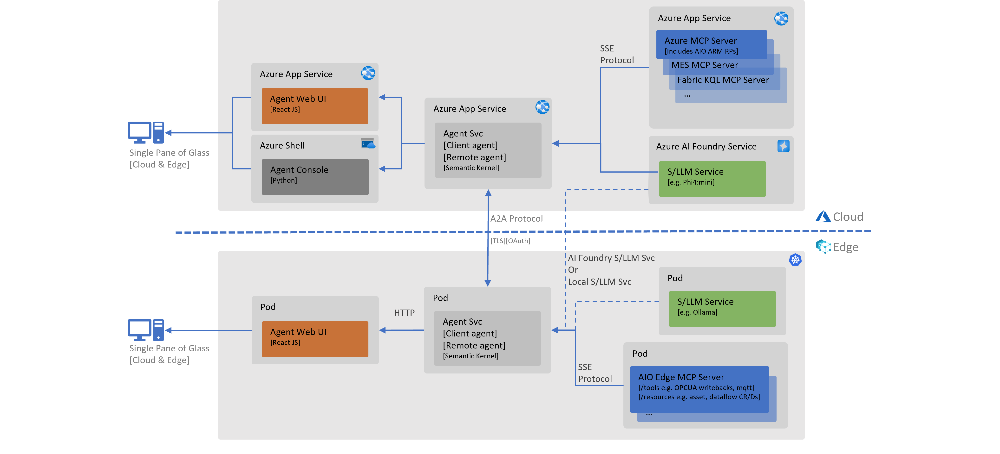

# AIO Sidekick [Agentic AI for Ops]

A repo to kickstart an Agentic AI based AIO assistant for industrial operations.

## Focus Area

The primary focus of this repo is to enable customers to build agents to assist with shop floor operations in AIO environments, both at the edge and in the cloud. The key features include:

1. Control Plane
   The control plane integration may include amending AIO artifacts which are configured as part of the shop floor setup, examples of such operations may include changing configuration of MQTT broker or asset endpoints, refactoring asset and tag names or updating MQTT topics as per UNS nomenclature.

2. Data Plane
   The data plane is responsible for transmitting data, this integration may include reading device data from the edge and cloud, write-backs as per process control operational requirements.

3. Management Plane
   The management plane oversees the overall system health and lifecycle, it includes monitoring, logging, and administrative tools to ensure the system is running efficiently and securely.

## Overview

AIO Sidekick provides an agentic AI assistant for industrial operations that integrates with the control, data, and management planes of AIO environment.

The architecture diagram below illustrates the key components and their interactions.

## Development Environment

...
